  
  
  
  
  
  
  

## `01` Power core

Mobile engineering leader with 13 years across **Flutter, native Android and native iOS**. I've shipped products with **10M+ downloads**, MoneyControl, CITI Mobile and Experian Credit Score among them, including a live-codebase migration to hybrid Flutter with no release freeze. I specialise in Add-to-App modernisation, Clean Architecture, offline-first data and the full testing pyramid, and I've led teams of up to 7 engineers from architecture through to release.

- **Now:** building [**Inspectro**](https://inspectro.dev), runtime DevTools for React, Next.js, Vue and Angular. Component inspection, render tracking, network activity and SSR execution in one surface.
- **Open to:** Mobile Architect · Developer Advocate · Developer Relations roles. Immediate joiner.
- **Community:** Lead Organizer, Flutter Hyderabad (2022 – present).
- **Reviewing:** Technical Reviewer for Packt Publishing's Android titles (2023 – 2025).
- **Fun fact:** professional by day, 90s kid by night. Still a huge fan of Cartoon Network and Pogo.

## `02` Flight log

| When | Role | Where | Signal |
| :-- | :-- | :-- | :-- |
| Aug 2026 – now | Creator & Sole Engineer | [Inspectro](https://inspectro.dev) | One DevTools surface across four frameworks, shipped on the VS Code Marketplace |
| Dec 2024 – Aug 2026 | Lead Software Engineer, Flutter | Experian | Led 7 senior Flutter engineers across 3 domain teams on Experian Credit Score (3.7M downloads, 4.6★) |
| Oct 2023 – Apr 2024 | Senior Software Development Engineer | Highspot | Cleared a two-year backlog of 117 P1/P2 defects in 40 days, for clients in 160 countries |
| Sep 2022 – Oct 2023 | Technical Lead | Network18 · MoneyControl | Flutter modules in the live native Android and iOS apps via Add-to-App (10M+ downloads) |
| Feb 2022 – Aug 2022 | Mobile Development Lead | Napses Technologies | In-house Flutter app that streamlined the QA team's bug reporting |
| Sep 2020 – Sep 2021 | Developer III | RealPage | OneSite Facilities, used at 23,000+ sites by 30,000+ technicians |
| Nov 2018 – Aug 2020 | Senior Consultant | Virtusa | Server-driven UI engine for CITI Mobile (10M+); Huntington Bank's move to Flutter; 98% coverage |
| Aug 2013 – Aug 2018 | Software Developer → Senior Software Engineer | Mersat-Tech · Fastlane · HighGo | Android apps for the Andhra Pradesh government; BLE-beacon indoor navigation |

## `03` Coil stack

The same four stacks as the reactor's coils, in the same colours.

| Stack | Coils |
| :-- | :-- |
| **Mobile** | &nbsp;Flutter&nbsp;&nbsp; &nbsp;Dart&nbsp;&nbsp; &nbsp;Android&nbsp;&nbsp; &nbsp;Kotlin&nbsp;&nbsp; &nbsp;Jetpack Compose&nbsp;&nbsp; &nbsp;Swift |
| **Web & Backend** | &nbsp;React&nbsp;&nbsp; &nbsp;Next.js&nbsp;&nbsp; &nbsp;TypeScript&nbsp;&nbsp; &nbsp;Node.js&nbsp;&nbsp; &nbsp;GraphQL&nbsp;&nbsp; &nbsp;.NET |
| **Analytics & AI** | &nbsp;Claude Code&nbsp;&nbsp; &nbsp;OpenAI API&nbsp;&nbsp; &nbsp;Mixpanel&nbsp;&nbsp; &nbsp;Snowflake |
| **DevOps & Cloud** | &nbsp;GitHub Actions&nbsp;&nbsp; &nbsp;Jenkins&nbsp;&nbsp; &nbsp;Docker&nbsp;&nbsp; &nbsp;Fastlane&nbsp;&nbsp; &nbsp;Firebase&nbsp;&nbsp; &nbsp;Google Cloud&nbsp;&nbsp; &nbsp;Neon |

## `04` On stage

- **Upcoming:** React Advanced London 2026 · FlutterCon India 2026
- **40+ talks and workshops**, including Google DevFest 2018 & 2019 and IWD India, plus a panel at TensorFlow User Groups 2023
- **Jury and trainer** at Smart India Hackathon; workshops on corporate, college and university campuses
- **Publications:** *M.A.D with Flutter* · *Android Slices – 3W's*
- **Slides** on [Speaker Deck](https://speakerdeck.com/hemandroid) · **Writing** on [hemandroid.me/blog](https://hemandroid.me/blog/)

## `05` Telemetry

  

## `06` Open channel

Hiring for a Mobile Architect, Developer Advocate or DevRel role, want a Flutter talk for your event, or just want to talk mobile? Email **hemasaicharan.k@gmail.com**, find me on [LinkedIn](https://linkedin.com/in/hemandroid), or start at [hemandroid.me](https://hemandroid.me).

   
  The reactor is generated by <a href="scripts/reactor.mjs"><code>scripts/reactor.mjs</code></a>: 20 coils, one per skill, each lit to its level.

